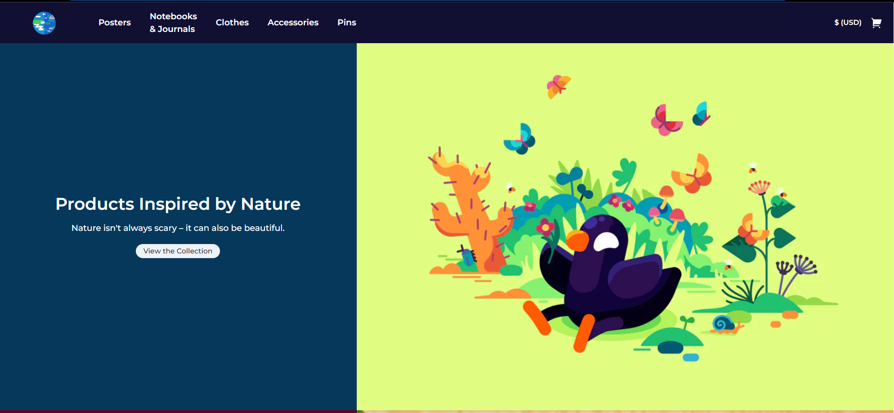
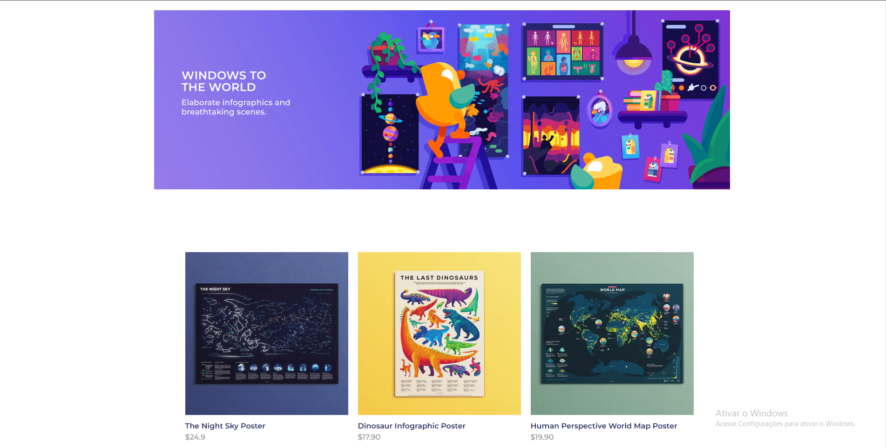
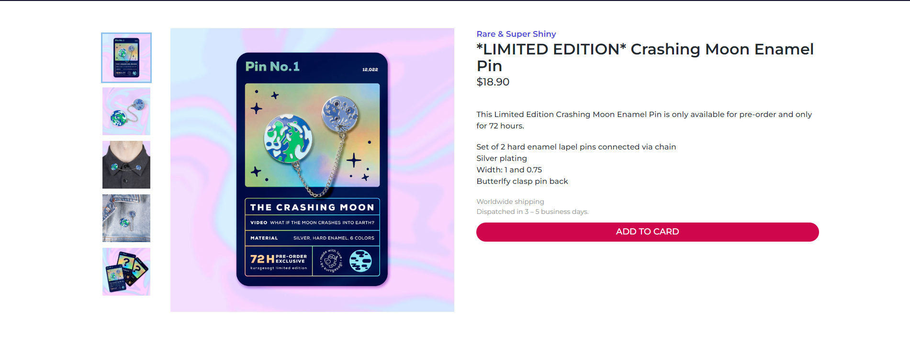

# dashgo

## Table of contents

- [Overview](#overview)
  - [Screenshot](#screenshot)
  - [Links](#links)
- [My process](#my-process)
  - [Built with](#built-with)  
  - [Continued development](#continued-development)
- [Author](#author)

## Overview

### Screenshot

### Home

### Collection

### Product

### Links

- [Link website](https://poucaspalavras.vercel.app/)

## My process

### Built with

- ReactJS
- NextJS
  - Typescript

-Library
  - Chakra UI

-Responsive

### Continued development

Feel free to put your feedback 🚀🚀

## Author

- Instagram - [@inanbrunelli](https://www.instagram.com/inanbrunelli)
- Github - [@inanbrunelli](https://github.com/inanbruneli)
- Website - [inanbrunell.com](https://inanbruneli.github.io/portifolio/)
- Linkedin - [@inanbrunelli](https://www.linkedin.com/in/inan-brunelli/)